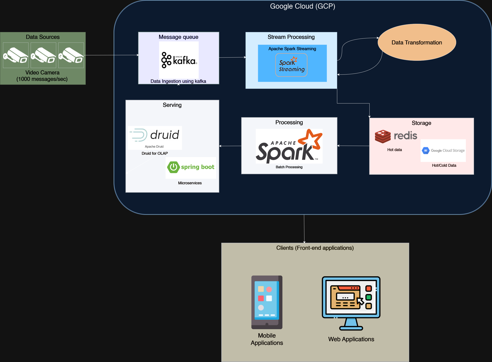

# Overview

A Spark application for processing and analyzing top items across locations, with optional data skew handling.

This application processes Parquet files containing detection data and location information to identify top items per location. It supports two processing strategies:
- Normal Processing: Standard RDD operations
- Skewed Processing: Handles data skew using salting technique

# Requirements

- Apache Spark 3.2.0+
- Scala 2.12.18
- SBT 1..10.5
- Java 17+
- Scala Test 2.12+

# Building

```bash
sbt clean package
```


# Design Considerations for project
1. RDD-based Implementation:
    - Used RDD for processing logic, and DataFrame for reading and writing parquet files

2. Performance Optimizations:
    - Used reduceByKey instead of groupByKey where possible
    - Minimized data movement across partitions
    - Implemented caching strategy for frequently used RDDs

3. Extensibility & Reusability (Clean Code and Best Practice)
    - Modular design with separate functions for skewed handling and normal data processing
      - The skew handling process uses salting for skered data distribution
    - Reusability of certain functions commonly used between skewed handling and normal processing
    - Configuration approach to specify if data requires skew handling

## Task 1
- As there might be duplicate detection_oid in the first parquet file, removal of duplicates is required to prevent duplicates.
  Implemented as a function using reduceByKey to be used by both normal and skew handling processes. Only the latest record with the 
  "detection_old" will be preserved.
```
def removeDuplicatedDetection(data1: RDD[(Long, Long, Long, String, Long)]): RDD[(Long, Long, Long, String, Long)] = {
    data1
      .map(detection => (detection._3, detection))
      .reduceByKey((_, value) => value)
      .values
  }
```

## Task 2
1. Skew Handling is implemented using processSkewedTopItems() by using salting for skewed data,
2. The different sorting strategies in Spark are Broadcast joins, Sort Merge joins and Shuffle Hash joins,
   - Broadcast Join
     - Ideally used for very small datasets. It is very fast but limited memory is available.
   - Sort Merge Join
     - Best used for large datasets as it is memory efficient and can handle data skew. However, it requires sorting.
     Not recommended for small datasets due to cost.
   - Shuffle Join
     - Ideally used for smaller datasets as it consumes a lot of memory and may affect performance

With all the joins explained, I will go with sort merge as it handles skew data, which is needed for this assignment and task 2, and it 
is more efficient. Currently it is not implement but is in the future enhancement/improvement for the assignment.

## Spark Configuration
SparkConfig created for resource config, memory management, performance tuning, and monitoring and bebugging.

   1. Resource Management 
      - Memory is allocated based on data volume
   2. Memory Management
      - Persistence of RDDs and unpersisting to free up memory
   3. Dynamic Allocation
      - Dynamic allocation allows auto-scaling
   4. Performance Tuning
      - used for automatic skew handling for joins
   5. Monitoring & Debugging
      - Event logging for monitoring and tracking. Logs are stored in the /resources/logs folder


## Unit and Integration Testing
Tests were written using ScalaTest


## Data Architecture Design




Given the scenario of each row in Parquet File 1 being produced by an upstream
producer and that the message rate is 1000 message per second, and the messages produced are consumed by downstream OLAP workloads for joining etc,
it suggests a high ingestion rate.


### Proposed Architecture

### Process

### Considerations
1. Scalability
2. Reliability
3. 

### Questions
1. Budget Constraints for services such as cloud
2. Data Retention Policies
   - required data retention period
3. Query latency and pattern Requirements 
   - Latency for OLAP Queries
4. System Availability (SLA)
   - Disaster Recovery 
   - Data back up frequency and requirements 
5. Expected processing and response time
6. Expected data and user load

### Tech Steck 
1. Tech
2. Storage