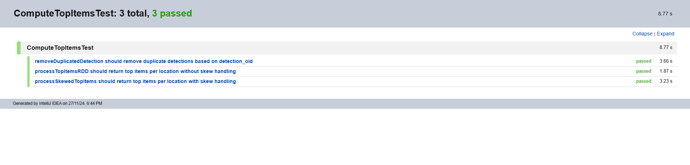

# Overview

A Spark application for processing and analyzing top items across locations, with optional data skew handling.

# Requirements

- Apache Spark 3.2.0+
- Scala 2.12.18
- SBT 1..10.5
- Java 17+
- Scala Test 2.12+

# Building
SBT:
```bash
sbt clean 

sbt compile

sbt test

```
### Setting up using Intellij
I used Intellij for this project. Below are the steps.
1. **Install IntelliJ IDEA**
    - Download and install IntelliJ IDEA from [here](https://www.jetbrains.com/idea/download/)
    - Install the Scala plugin:
        - Go to `Settings/Preferences → Plugins`
        - Search for "Scala" and install

2. **Import Project**
3. **Configure SDK for project**
- Right-click project in project explorer → Module Settings
- Project Settings → Project → Set SDK to Java 8+ (or later)
- Project Settings → Global Libraries → Add Scala SDK, and apache spark

# Design Considerations for project
1. RDD-based Implementation:
    - Used RDD for processing logic, and DataFrame for reading and writing parquet files

2. Performance Optimizations:
    - Used reduceByKey instead of groupByKey where possible
    - Minimized data movement across partitions
    - Implemented caching strategy for frequently used RDDs

3. Extensibility & Reusability (Clean Code and Best Practice)
    - Modular design with separate functions for skewed handling and normal data processing
      - The skew handling process uses salting for skered data distribution
    - Reusability of certain functions commonly used between skewed handling and normal processing
    - Configuration approach to specify if data requires skew handling

## Task 1
- As there might be duplicate detection_oid in the first parquet file, removal of duplicates is required to prevent duplicates.
  Implemented as a function using reduceByKey to be used by both normal and skew handling processes. Only the latest record with the 
  "detection_old" will be preserved.
```
def removeDuplicatedDetection(data1: RDD[(Long, Long, Long, String, Long)]): RDD[(Long, Long, Long, String, Long)] = {
    data1
      .map(detection => (detection._3, detection))
      .reduceByKey((_, value) => value)
      .values
  }
```

## Task 2
1. Skew Handling is implemented using processSkewedTopItems() by using salting for skewed data,
2. The different sorting strategies in Spark are Broadcast joins, Sort Merge joins and Shuffle Hash joins,
   - Broadcast Join
     - Ideally used for very small datasets. It is very fast but limited memory is available.
   - Sort Merge Join
     - Best used for large datasets as it is memory efficient and can handle data skew. However, it requires sorting.
     Not recommended for small datasets due to cost.
   - Shuffle Join
     - Ideally used for smaller datasets as it consumes a lot of memory and may affect performance

With all the joins explained, I will go with sort merge as it handles skew data, which is needed for this assignment and task 2, and it 
is more efficient. Currently it is not implement but is in the future enhancement/improvement for the assignment.

## Spark Configuration
SparkConfig created for resource config, memory management, performance tuning, and monitoring and bebugging.

   1. Resource Management 
      - Memory is allocated based on data volume
   2. Memory Management
      - Persistence of RDDs and unpersisting to free up memory
   3. Dynamic Allocation
      - Dynamic allocation allows auto-scaling
   4. Performance Tuning
      - used for automatic skew handling for joins
   5. Monitoring & Debugging
      - Event logging for monitoring and tracking. Logs are stored in the /resources/logs folder


## Unit and Integration Testing
Tests were written using ScalaTest. Unit tests and integration test are covered.


### Unit Tests

1. Duplicated Detection Test
- Test `removeDuplicatedDetection()` method to ensure there are no
duplicated items based on detection_old.
2. Top X items Processing for Normal Data
- Test `processTopItemsRDD()` method to ensure process will count top items
based on TopX by location and rank it by its frequency.
3. Top X items processing skewed data
    - Test `processSkewedTopItems()` method to ensure process will handle skewed data before counting the top items
      based on TopX by location and rank it by its frequency.


[Test result generated for unit tests](src/test/resources/ComputeTopItemsTestResult.html)


### Integration Tests
The intgretation test ensures that the end to end process is working without any issues.

[Test result generated for Integration test](src/test/resources/IntegrationTestResult)


## Data Architecture Design

Given the scenario of each row in Parquet File 1 being produced by an upstream
producer and that the message rate is 1000 message per second, and the messages produced are consumed by downstream OLAP workloads for joining etc,
it suggests a high ingestion rate.


### Proposed Architecture


### Assumptions
1. Front end applications will utilise real-time data more, while OLAP will use cold data
2. Data Retention:
- Hot Storage: 24 hours
- Cold Storage: 90 days
3. Response time for queries is acceptable as long as it is < 100ms latency

### Tech Stack
**Tech**
- Kafka
- Apache Spark Streaming
- Apache Spark Batch processing
- Google Cloud Platform
- Spring boot for microservices
- Apache Druid

**Storage**
- Redis for hot data
- Google cloud storage for hot/cold data

### Design and Justification

#### Google Cloud Platform

#### Data Source

- The data source will be the **video cameras** across the different locations. Throughput will be 1000 message per second.

#### Data Ingestion

- **Apache Kafka**
  - Use Kafka for processing 1000 messages/sec 
  - Kafka is able to handle high throughput, which in our case is 1000 messages/second. 
  - It is also scalable with its partitioning capabilities and it allows data to distribute data quickly
  across multiple servers if needed. This also means that it is low in latency.

#### Stream Processing
- ** Apache Spark Streaming **
  - Real-time data processing which allows insights from data and make decision or take action based on
  real-time information
  - It also allows event monitoring
  - Fast and integrates well with various data sources, including Kafka
  
#### Storage
**Hot Data**
- Redis
  - Redis provides caching capabilities, which means it is fast in both writes and reads
  - In-memory data storage, which is also fast
  - Low latency
- Google Cloud Storage (GCS)
  - Since GCP is used, GCS is ideal to allow easy integration with GCP
  - GCS provides scalable storage for both hot and cold data
  - Scalable

**Cold Data**
- Google Cloud Storage (GCS)
  - Since GCP is used, GCS is ideal to allow easy integration with GCP
  - GCS provides scalable storage for both hot and cold data
  - Cost-effective for long term storage, and they offer different tiers of cold data (30-90 days)
  - Scalable

#### Processing
**Apache Spark Batch Processing**
-  ETL workflows, aggregations, and ML model training using historical data.

#### Serving

**Apache Druid**
- Optimised for OLAP workloads
- Handles high concurrency 

**Spring Boot**
- Spring boot allows us to create microservices for web and mobile applications easily
- It also promotes modularity and loose coupling, which also promotes independent deployment
- It integrates with many tech stacks, hence it is flexible
- Scalable and Maintainable 

### Considerations

Below are factors taken into consideration when deciding on the tools used:

1. Scalability

    Scalability is important to keep system fault-tolerant especially when it comes to handling 
huge data volumes, user traffic or load. Horizontal and vertical scaling of data storage is important 
to ensure system is scalable.


2. Reliability

    Reliability is also important to keep system fault-tolerant and to prevent any possible data loss.
Hence, backup/disaster recovery is an important factor.


4. Performance
    Caching can significantly improve performance and efficiency of the system as it allows fast
   retrievals such as in-memory storage, it also reduces the load on databases.
   Hence,with caching, the system can be faster and handle more requests.
- Partionining, indexing and query optimisation. Effective use of these functions can 
improve performance and efficiency and reduce latency.

5. Cost 

   Data access can be very expensive, hence it is important to consider storage and query costs, 
   and tools & services such as cloud storage.

6. Security

    Data breaches can be severe, hence it is important to consider security features 
such as encryption, authentication and authorisation (i.e. Access Control)

7. Monitoring

   - Monitoring helps to identify issues and anomalies before and keep system fault-tolerant
   - It also helps to track unauthorised access, if any
   - It can also provide insights to optimise load, performance and cost
   

### Questions
1. Budget Constraints for services such as cloud
2. Data Retention Policies
   - required data retention period
3. Query latency and pattern Requirements 
   - Latency for OLAP Queries
4. System Availability (SLA)
   - Disaster Recovery 
   - Data back up frequency and requirements 
5. Expected processing and response time
6. Expected data and user load


# Improvements
Following are considerations made but not implemented:
1. Better joining approach or algorithms
2. Implement caching
3. Better modularity design to promote reusability of code and best practices
